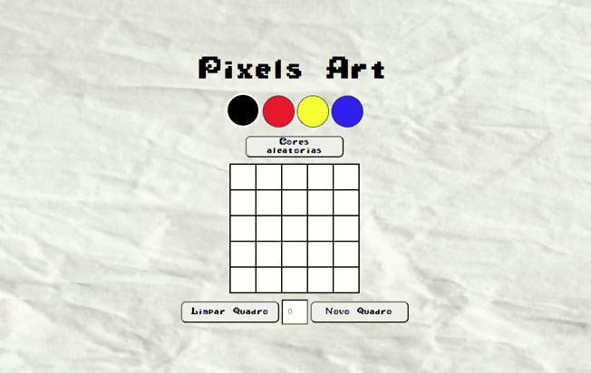

# :art: Projeto Pixel Art :art:

- Utilize as cores presentes na paleta para criar seus próprios desenhos no pixel-board.
- Utilize o botão para gerar cores aleatorias para sua paleta
- Gere um quadro com a quantidade de pixeis que desejar
- Seus desenhos assim como as cores geradas na paleta ficarão salvas para que você possa continuar criando mesmo que tenha que sair e voltar a página

## Projeto sendo executado

## Habilidades Trabalhadas

- Manipulação do JavaScript

- Manipulação do CSS

- Manipulação do DOM

## Tecnologias utilizadas

 &nbsp;
 &nbsp;
 &nbsp;
 &nbsp;

# Como acessar a aplicação
Link da aplicação <a target="_blank" href='https://pixels-art-psi.vercel.app/'>Pixel Art</a>

---

# :construction: Projeto em construção  :construction:
### Futuras atualizações:

- Permitir que a paleta tenha mais opção de cores
- Permitir que o usuário possa escolher o número de linhas e colunas
- Botao de reset para voltar ao estado inicial

Fique a vontade caso queira clonar o repositório e sugerir alterações, toda ideia vista da perspectiva correto é uma ideia genial 💡
